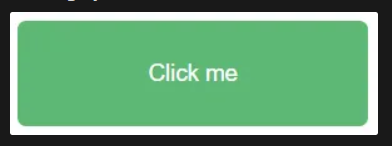

# JAVASCRIPT CƠ BẢN PHẦN 4

### Câu 01: Ẩn thông báo (Ví dụ 01)

Đề bài: Sử dụng setTimeout để  tự động ẩn nó sau một khoảng thời gian

### Câu 02: Ẩn thông báo (Ví dụ 02)

Đề bài: Sử dụng setTimeout để làm mờ thông báo sau một khoảng thời gian.

### Câu 03: Thay đổi nội dung một phần tử.

Đề bài: Cho đoạn mã HTML sau, Lấy phần tử bằng ID và thay đổi nội dung của phần tử đó thành: "Nội dung mới"

```html
<div id="element">
  Nội dung hiện tại
</div>
```

### Câu 04: Thay đổi màu chữ.

Đề bài: Cho đoạn mã HTML sau, Lấy danh sách các phần tử có cùng class là "title" và thay đổi thuộc tính của chúng thành màu blue.

```javascript
<h2 class="title">Tiêu đề 1</h2>
<h2 class="title">Tiêu đề 2</h2>
<h2 class="title">Tiêu đề 3</h2>
<h2 class="title">Tiêu đề 4</h2>

<h2 class="title-2">Tiêu đề 5</h2>
<h2 class="title-2">Tiêu đề 6</h2>
```

### Câu 05: Đổi màu nền sau một khoảng thời gian

Đề bài: Đổi màu nền website sau một khoảng thời gian nhất định.

### Câu 06: Thay đổi nút bấm

- Đề bài:
    - Tạo một nút và sau một khoảng thời gian nút bấm sẽ thay đổi kích thước và màu sắc.
    
    Ban đầu:
         

    Sau 5 giây:
         

### Câu 07: Seven Boom!

Đề bài: Tạo một hàm nhận vào một mảng các số và trả về "Boom!" nếu số 7 xuất hiện trong mảng. Ngược lại, trả về "Không có số 7 trong mảng".

Ví dụ:
```javascript
sevenBoom([1, 2, 3, 4, 5, 6, 7]) ➞ "Boom!"

sevenBoom([8, 6, 33, 100]) ➞ "Không có số 7 trong mảng"

sevenBoom([2, 55, 60, 97, 86]) ➞ "Boom!"
```

### Câu 08: Phân phối tần suất của một mảng

Đề bài: Tạo một hàm trả về phân phối tần suất của một mảng. Hàm này sẽ trả về một đối tượng, trong đó các khóa là các phần tử duy nhất và các giá trị là tần suất xuất hiện của các phần tử đó.

```javascript
getFrequencies(["A", "B", "A", "A", "A"]) ➞ { A: 4, B: 1 }

getFrequencies([1, 2, 3, 3, 2]) ➞ { "1": 1, "2": 2, "3": 2 }

getFrequencies([true, false, true, false, false]) ➞ { true: 2, false: 3 }

getFrequencies([]) ➞ {}
```

### Câu 09: Số Disarium

Đề bài: Một số được gọi là Disarium nếu tổng của các chữ số mũ với vị trí tương ứng của chúng là chính số đó. 

```javascript
isDisarium(75) ➞ false
// 7^1 + 5^2 = 7 + 25 = 32

isDisarium(135) ➞ true
// 1^1 + 3^2 + 5^3 = 1 + 9 + 125 = 135

isDisarium(544) ➞ false

isDisarium(518) ➞ true

isDisarium(8) ➞ true

isDisarium(466) ➞ false
```

-   Ghi chú:
    -   Vị trí của chữ số được tính bắt đầu từ 1.
    -   Ví dụ: Số 135 có 1 ở vị trí 1, 3 ở vị trí 2, 5 ở vị trí 3.

### Câu 10: Hoán đổi ký tự

Đề bài: Viết một hàm để thay thế tất cả các ký tự c1 bằng ký tự c2 và ngược lại.

```javascript
doubleSwap( "aabbccc", "a", "b") ➞ "bbaaccc”

doubleSwap("random w#rds writt&n h&r&", "#", "&") ➞ "random w&rds writt#n h#r#"

doubleSwap("128 895 556 788 999", "8", "9") ➞ "129 985 556 799 888"
```

-   Lưu ý:
    -   Cả hai ký tự đều xuất hiện ít nhất một lần trong chuỗi.

### Câu 11: Số Pronic

Đề bài: - Một số pronic (hay còn được gọi là heteromecic) là một số được tạo ra bởi tích của hai số nguyên liên tiếp, nghĩa là, một số có dạng n(n + 1).

-   Tạo một hàm để xác định xem một số có phải là pronic hay không.

```javascript
isHeteromecic(0) ➞ true
// 0 * (0 + 1) = 0 * 1 = 0

isHeteromecic(2) ➞ true
// 1 * (1 + 1) = 1 * 2 = 2

isHeteromecic(7) ➞ false

isHeteromecic(110) ➞ true
// 10 * (10 + 1) = 10 * 11 = 110

isHeteromecic(136) ➞ false

isHeteromecic(156) ➞ true
```

### Câu 12: Thay đổi chuỗi thành camelCase

Đề bài: Sử dụng camelCase là khi từ đầu tiên viết thường, và tất cả các từ sau đó đều viết hoa chữ cái đầu tiên, các chữ còn lại viết thường. Lưu ý rằng không có khoảng trắng giữa các từ!

```javascript
camelCasing("Hello World") ➞ "helloWorld"

camelCasing("snake_case") ➞ "snakeCase"

camelCasing("low high_HIGH") ➞ "lowHighHigh"
```

-   Lưu ý:
    -   Bạn cần loại bỏ tất cả các khoảng trắng và dấu gạch dưới.
    -   Không có số trong đầu vào.

### Câu 13: Tìm ký tự đầu tiên lặp lại

- Đề bài: Viết một hàm nhận vào một chuỗi và trả về ký tự đầu tiên mà lặp lại. Nếu không có ký tự nào lặp lại, trả về "-1".

```javascript
firstRepeat("legolas") ➞ "l"

firstRepeat("Gandalf") ➞ "a"

firstRepeat("Balrog") ➞ "-1"

firstRepeat("Isildur") ➞ "-1"
// Phân biệt chữ hoa chữ thường, "I" không bằng "i"
```

### Câu 14: Số nhiều!

Đề bài: Viết một hàm nhận vào một danh sách các từ ở dạng số ít và trả về một tập hợp các từ ở dạng số nhiều nếu chúng xuất hiện nhiều hơn một lần trong danh sách.

```javascript
pluralize(["cow", "pig", "cow", "cow"]) ➞ ["cows", "pig"]

pluralize(["table", "table", "table"]) ➞ ["tables"]

pluralize(["chair", "pencil", "arm"]) ➞ ["chair", "pencil", "arm"]
```

-   Lưu ý:
    -   Chỉ tập trung vào việc có nên thêm chữ **s** vào cuối từ hay không.

### Câu 15:

Đề bài: - Yêu cầu tạo một đối tượng lưu trữ các chỉ số của mỗi ký tự trong một mảng, với ký tự là khóa và chỉ số là giá trị.

-   Đảm bảo rằng:
    -   Các ký tự là các khóa.
    -   Các ký tự là các ký hiệu.
    -   Các chỉ số được lưu trữ trong một mảng và các mảng đó là các giá trị.

```javascript
mapLetters("dodo") ➞ { d: [0, 2], o: [1, 3] }

mapLetters("froggy") ➞ { f: [0], r: [1], o: [2], g: [3, 4], y: [5] }

mapLetters("grapes") ➞ { g: [0], r: [1], a: [2], p: [3], e: [4], s: [5] }
```